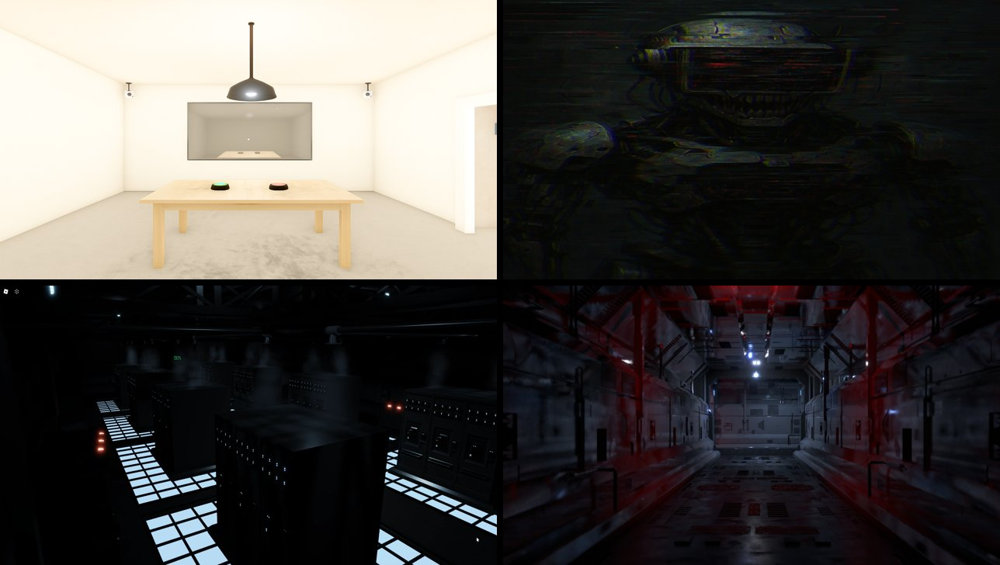

# Anomali Tespiti: Doğrulama Protokolü

A psychological horror visual novel made with **Ren'Py**. You are an operator of the AI system *ANAÇ*, and your job is to interrogate digital entities that want to join the system. Some of them are what they claim to be. Some are anomalies.



*The game is in Turkish.*

## Gameplay

- **Interrogation:** each entity comes with a manifest. Inspect it, run a visual analysis and cross-examine the entity to find inconsistencies.
- **Decision:** approve or reject. A correct call raises your trust score, a wrong one drops it sharply.
- **Trust score:** starts at 100. As it falls the interrogation room gets darker, the music changes and the system starts warning you.
- **Chase:** if the score hits zero, the system turns on you. Escape through server rooms, ventilation shafts, labs and the rooftop. Each route has its own choices, dead ends and endings.
- **Checkpoints and statistics:** progress is saved between attempts, and the game over screen shows your accuracy, quiz answers and play time.

## What's inside

| | |
|---|---|
| Script | ~2,400 lines of Ren'Py script: dialogue, branching, game state and Python helpers |
| Custom screens | Interrogation menu, status panel, game over screen with statistics |
| Effects | Glitch and shake transforms, mood-dependent backgrounds and music |
| Entities | Six entities with their own manifests, clues and outcomes |
| Locations | 20 backgrounds for the interrogation room and the escape routes |
| Audio | Six music tracks and nine sound effects |

## Running

1. Install the [Ren'Py SDK](https://www.renpy.org/latest.html) (8.3 or newer).
2. Clone this repository and select it as a project in the Ren'Py launcher.
3. Click **Launch Project**.

## Project structure

```
game/
├── script.rpy      # Story, entities, game logic
├── screens.rpy     # UI screens
├── gui.rpy         # Theme settings
├── options.rpy     # Game configuration
├── images/         # Backgrounds, entities, UI
└── audio/          # Music and sound effects
```

Made as a course project at Kocaeli Health and Technology University, Computer Engineering.
